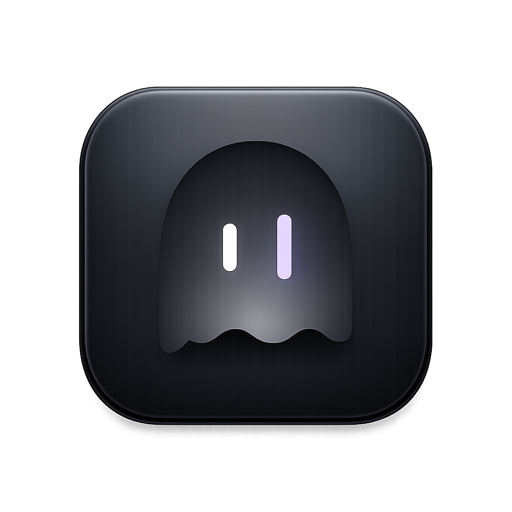
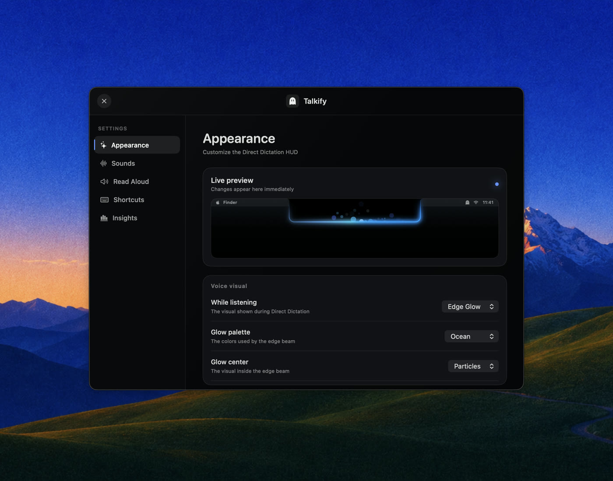
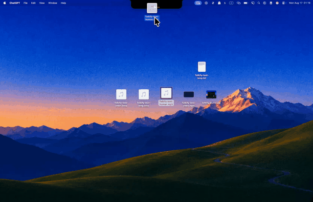

<p align="center">
  
  <h1 align="center">Talkify</h1>
</p>

<h3 align="center">Fast, private voice dictation for macOS, right from the notch</h3>

<p align="center">
  
  
  
  
</p>

## Showcase


<p align="center">
  
</p>

<p align="center">
  
  
</p>

## Privacy

Everything is on-device: Apple's `SpeechAnalyzer`/`SpeechTranscriber` for recognition, `AVSpeechSynthesizer` for Read Aloud. Talkify makes no network requests, stores no audio, and keeps no history beyond the local usage metrics you can see in Insights.

Two caveats. Read Aloud reads a selection through Accessibility where it can,
and by copying it where it cannot, which is any web page: the selection passes
through the clipboard and the previous clipboard is put back afterwards.

And dictated text is inserted by pasting it, so it passes through the system clipboard for up to about half a second before your previous clipboard is put back. A clipboard manager or Universal Clipboard can see it during that window.

## Requirements

- macOS 26 (Tahoe) on Apple Silicon

## Install

With Homebrew:

```bash
brew tap tornikegomareli/talkify https://github.com/tornikegomareli/Talkify
brew trust --tap tornikegomareli/talkify
brew install --cask talkify
```

Homebrew 6 refuses to load anything from a third-party tap until you trust it,
so the middle line is required. It is asking whether you trust this repository;
[read the cask](Casks/talkify.rb) first if you would rather check what it does.

Or grab [**Talkify.dmg**](https://github.com/tornikegomareli/Talkify/releases/latest/download/Talkify.dmg) from the latest release.

Build from source:

```bash
git clone https://github.com/tornikegomareli/Talkify.git
cd Talkify
open Talkify.xcodeproj   # ⌘R
```

Or headless:

```bash
xcodebuild -project Talkify.xcodeproj -scheme Talkify -configuration Debug build
```

Run the tests the same way CI does:

```bash
xcodebuild test -project Talkify.xcodeproj -scheme Talkify -destination 'platform=macOS'
```

## Using it

| Action | Gesture |
|---|---|
| Dictate | Hold **fn**, speak, release |
| Hands-free session | Quick-tap **fn**, speak, tap again to finish |
| Dictate in your second language | Hold **right ⌥** instead |
| Dictate and translate | Hold **right ⌘** instead |
| Transcribe a file | Drag audio or video at the notch and drop it |
| Cancel mid-session | **Esc** |
| Pick the shaping prompt mid-session | **←** / **→** while dictating, with shaping on |
| Read selected text aloud | **⌥ ⎋** (toggles; also in the menu) |
| Read it aloud translated | Same key, with **Translate before speaking** on |
| Everything else | Menu bar ghost → Settings |

The trigger and the Read Aloud shortcut are rebindable in **Settings → Shortcuts**.
Direct Dictation can use a keyboard key, Middle Click by pressing the scroll
wheel, or another auxiliary mouse button. A bound button keeps its usual action
unless the exact combination you bound is pressed, so binding ⌥ + Middle Click
leaves plain middle click alone.

## Drop a file on the notch

<p align="center">
  
</p>

Drag an audio or video file to the top of the screen and the island opens to
take it. It transcribes in the background, so **fn** keeps working, and the menu
bar ghost shows progress.

When it finishes the island comes back holding the transcript. Drag it to a
folder for the `.txt`, or to a text field for the words. Click to copy. Leave it
and after five seconds it saves next to the source file, or into a folder you set
in **Settings → Drop Transcription**. Hovering pauses that timer.

With a second dictation language configured, the target splits in two and the
half you drop on picks the language. **Transcribe File…** in the menu does the
same with a picker.

## Speak one language, insert another

Pick a language in **Settings → Language** and the Translate key writes in it.
Hold **right ⌘**, say it in English, and Spanish lands in the document. The key
does not change when the language does, so there is one shortcut to remember.

Translation runs on your Mac through Apple's Translation framework, and the notch
shows the pair before you speak. If it fails, nothing is pasted and your words go
to the clipboard.

It works the other way too. Turn on **Translate before speaking** in
**Settings → Read Aloud**, select text in a language you do not read, and the
Read Aloud key speaks it in your voice's language. The voice is the target, so
there is nothing else to set.

## Shape what you dictate (beta)

Turn on **Shape dictation with a prompt** in **Settings → Dictation** and the
prompt you pick rewrites finished dictation through Apple's on-device model
before it is inserted. Three prompts are built in — tighten grammar, bullet
lists, remove filler words — and **Manage Prompts…** lets you edit them or
write your own: your wording sits before and after the transcript, and the
framing that keeps the model rewriting your words instead of answering them is
fixed and not editable.

While you dictate, a band below the voice visual and the live draft names the
prompt the session will shape with, and the bare arrow keys cycle through your
prompts — or **None**, to insert the words exactly as spoken. After you
release, the island stays up and the same band shows a progress bar while the
rewrite runs. Shaping is a beta and fails safe: any error, or
an answer slower than ten seconds, inserts your raw words unchanged, history
keeps what you actually said, and nothing leaves your Mac.

## Two languages, two triggers

Pick a second language in **Settings → Language** and it gets its own trigger. Hold
**fn** for English, hold **right ⌥** for German, with no setting to change in
between. Both triggers are rebindable, and either can use a keyboard key or a
supported mouse button.

## Architecture

Code is organized into folders, callbacks only flow one way from the main wiring point, and a pure reducer handles the state.

- `App/`: composition root, settings store, status item
- `Input/`: the global key event tap and recorded bindings
- `Dictation/`: the session machine (`DictationSessionMachine`, a pure tested reducer), the speech/insertion services, and the HUD surface and voice visuals only dictation draws
- `Translation/`: the coordinator both callers talk to, the rules, and the two files that import Apple's Translation framework
- `DropTranscription/`: the drag gesture, the file transcription service, where a transcript is staged and lands, and its own HUD surfaces
- `CoreHUD/`: what both features share: `HUDStage` owns the single panel and decides who holds the shape, plus the geometry seams and Metal shaders
- `ReadAloud/`, `Settings/`, `Insights/`

`CONTEXT.md` is the domain doc, decisions live in `docs/adr/`, and
[`CONTRIBUTING.md`](CONTRIBUTING.md) is the contract for changing any of it

## Roadmap

- **Live Captions & Meeting Transcripts**. Ephemeral captions from a selected app's audio (Chrome, YouTube, meeting apps), and the saved, timestamped transcript as a separate action. The domain design already lives in `CONTEXT.md`; the recognition pipeline is ready for non-microphone audio.
- **Text cleanup**. Shipping as the prompt shaping beta above — on-device rewriting of finished dictation, off by default. Per-application profiles and a benchmarked default remain future work; with shaping off, Talkify still inserts exactly what you said.
- **Snippets**. Saved text blocks inserted by a spoken trigger word: say your trigger mid-dictation and the whole block lands instead.

## Contributing

Read [**CONTRIBUTING.md**](CONTRIBUTING.md) first. It covers the issue-first
flow, branch and pull request naming, code style, the AI policy, and what a bug
report needs to contain to be actionable.

Start from an issue. A pull request that arrives without one behind it may be
closed, however good the code is, because design belongs in the issue where it is
still cheap to change.

## License
[MIT](LICENSE)
